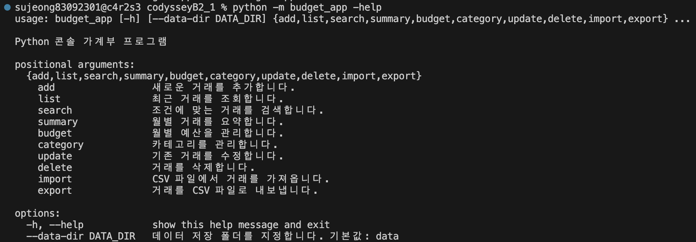
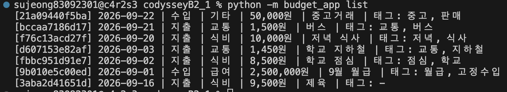
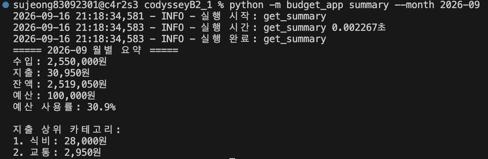

# Python 콘솔 가계부

Python 표준 라이브러리만 사용하여 구현한 콘솔 기반 가계부
애플리케이션입니다.

거래 내역, 카테고리, 월별 예산을 파일에 영구 저장하며 CLI 명령을 통해
가계부를 관리할 수 있습니다.

## 실행 화면

프로그램의 주요 실행 화면입니다.








## 주요 기능

1.  거래 추가
2.  거래 목록 조회
3.  거래 검색
4.  월별 수입·지출·잔액 요약
5.  월별 예산 설정 및 초과 경고
6.  카테고리 추가·조회·삭제
7.  거래 수정
8.  거래 삭제
9.  CSV 가져오기 및 내보내기
10. JSONL 파일 기반 영구 저장

추가 구현 사항:

-   Generator를 이용한 거래 조회 스트리밍
-   Dataclass 기반 데이터 모델
-   타입 힌트 적용
-   Decorator를 이용한 공통 기능 처리
-   거래 수정·삭제 시 안전한 파일 교체
-   오류 발생 시 스택 트레이스 대신 사용자 친화적인 오류 메시지 출력

## 실행 환경

-   Python 3.10 이상
-   Python 표준 라이브러리만 사용
-   별도의 외부 패키지 설치 불필요

## 실행 방법

프로젝트 루트에서 실행합니다.

``` bash
python -m budget_app --help
```

기본 데이터 저장 위치는 `./data`입니다.

저장 위치를 변경하려면 `--data-dir` 옵션을 사용할 수 있습니다.

``` bash
python -m budget_app --data-dir ./my_data list
```

## 명령어 사용법

### 1. 거래 추가

``` bash
python -m budget_app add
```

실행 후 날짜, 거래 타입, 카테고리, 금액, 메모, 태그를 순서대로
입력합니다.

예:

``` text
날짜 (YYYY-MM-DD): 2026-09-20
거래 타입 (income/expense): expense
카테고리: 식비
금액: 10000
메모 (선택): 저녁 식사
태그 (쉼표로 구분, 선택): 저녁,식사
```

거래가 정상적으로 추가되면 생성된 거래 ID가 출력됩니다.

### 2. 거래 목록 조회

``` bash
python -m budget_app list
```

조회할 거래 수를 제한할 수 있습니다.

``` bash
python -m budget_app list --limit 3
```

거래는 최신 날짜 순으로 조회됩니다.

### 3. 거래 검색

카테고리 검색:

``` bash
python -m budget_app search --category 식비
```

거래 타입 검색:

``` bash
python -m budget_app search --type expense
```

기간 검색:

``` bash
python -m budget_app search --from 2026-09-01 --to 2026-09-30
```

메모 검색:

``` bash
python -m budget_app search --q 카페
```

태그 검색:

``` bash
python -m budget_app search --tag 교통
```

여러 조건을 함께 사용할 수도 있습니다.

``` bash
python -m budget_app search --from 2026-09-01 --to 2026-09-30 --type expense --category 식비
```

### 4. 월별 요약

``` bash
python -m budget_app summary --month 2026-09
```

지출 상위 카테고리 개수를 지정할 수 있습니다.

``` bash
python -m budget_app summary --month 2026-09 --top 3
```

요약에는 다음 정보가 표시됩니다.

-   총 수입
-   총 지출
-   잔액
-   설정된 예산
-   예산 사용률
-   지출 상위 카테고리

조회 대상 월에 거래가 없으면 `데이터 없음`을 표시합니다.

### 5. 예산 설정

``` bash
python -m budget_app budget set --month 2026-09 --amount 100000
```

설정한 예산은 월별 요약에서 확인할 수 있습니다.

``` bash
python -m budget_app summary --month 2026-09
```

지출이 설정된 예산을 초과하면 경고 메시지가 표시됩니다.

### 6. 카테고리 관리

카테고리 목록:

``` bash
python -m budget_app category list
```

카테고리 추가:

``` bash
python -m budget_app category add --name 여행
```

카테고리 삭제:

``` bash
python -m budget_app category remove --name 여행
```

거래에서 사용 중인 카테고리는 삭제할 수 없습니다.

### 7. 거래 수정

이 프로젝트의 거래 수정 방식은 **CLI 옵션 방식**으로 구현했습니다.

``` bash
python -m budget_app update --id 거래ID --memo "수정된 메모"
```

수정할 항목만 옵션으로 지정하면 해당 항목만 변경됩니다.

예:

``` bash
python -m budget_app update --id 거래ID --amount 12000 --tags 저녁,식사
```

존재하지 않는 거래 ID를 입력하면 오류 메시지가 표시됩니다.

### 8. 거래 삭제

``` bash
python -m budget_app delete --id 거래ID
```

존재하지 않는 거래 ID를 입력하면 오류 메시지가 표시됩니다.

### 9. CSV 가져오기

``` bash
python -m budget_app import --from test.csv
```

CSV 파일은 UTF-8 형식이며 헤더를 포함해야 합니다.

가져오기가 완료되면 추가된 거래 건수가 출력됩니다.

### 10. CSV 내보내기

월 기준으로 내보내기:

``` bash
python -m budget_app export --out exported.csv --month 2026-09
```

기간 기준으로 내보내기:

``` bash
python -m budget_app export --out exported.csv --from 2026-09-01 --to 2026-09-30
```

내보내기가 완료되면 저장된 거래 건수가 출력됩니다.

## CSV 스키마

CSV 파일은 헤더를 포함해야 합니다.

### 필수 컬럼

  컬럼         설명
  ------------ --------------------------
  `date`       거래 날짜 (`YYYY-MM-DD`)
  `type`       `income` 또는 `expense`
  `category`   등록된 카테고리
  `amount`     0보다 큰 정수 금액

### 선택 컬럼

  컬럼     설명
  -------- --------------------
  `memo`   거래 메모
  `tags`   쉼표로 구분한 태그

예시:

``` csv
date,type,category,amount,memo,tags
2026-09-20,expense,식비,10000,저녁 식사,"저녁,식사"
2026-09-21,expense,교통,1500,버스,"교통,버스"
2026-09-22,income,기타,50000,중고거래,"중고,판매"
```

## 데이터 저장

기본 데이터 저장 위치:

``` text
./data/
├── transactions.jsonl
├── categories.jsonl
└── budgets.jsonl
```

`--data-dir` 옵션을 이용하면 저장 위치를 변경할 수 있습니다.

``` bash
python -m budget_app --data-dir ./my_data list
```

### 파일별 역할

  파일                   저장 내용
  ---------------------- -----------------
  `transactions.jsonl`   거래 내역
  `categories.jsonl`     등록된 카테고리
  `budgets.jsonl`        월별 예산

JSONL(JSON Lines) 형식을 사용하며 프로그램 실행에 필요한 파일이 없으면
자동으로 생성됩니다.

실제 거래 데이터와 CSV 파일은 `.gitignore`를 통해 Git 추적 대상에서
제외합니다.

## 거래 데이터 구조

거래는 다음 정보를 가집니다.

``` text
id        : 거래 고유 ID
type      : income / expense
date      : YYYY-MM-DD
amount    : 양의 정수
category  : 등록된 카테고리
memo      : 선택 입력
tags      : 선택 입력
```

## 입력값 검증

사용자가 입력한 값에 대해 다음 항목을 검증합니다.

-   날짜 형식
-   월 형식
-   거래 타입
-   금액의 정수 여부
-   금액이 0보다 큰지 여부
-   등록된 카테고리인지 여부
-   카테고리 이름
-   `limit` 값
-   `top` 값

잘못된 입력이 들어오면 원인을 알려주고 다시 입력할 수 있도록 처리합니다.

존재하지 않는 거래 ID를 수정하거나 삭제하는 경우에도 오류 메시지를
출력합니다.

## 프로젝트 구조

``` text
budget_app_project/
├── budget_app/
│   ├── __init__.py
│   ├── __main__.py
│   ├── cli.py
│   ├── commands.py
│   ├── models.py
│   ├── repository.py
│   ├── services.py
│   ├── validators.py
│   ├── decorators.py
│   └── formatters.py
├── src/
│   └── images/
│       ├── main.png
│       ├── list.png
│       └── summary.png
├── data/
│   ├── transactions.jsonl
│   ├── categories.jsonl
│   └── budgets.jsonl
├── tests/
│   └── __init__.py
├── README.md
└── .gitignore
```

### 모듈별 역할

-   `models.py`: 거래, 예산, 카테고리 데이터 모델
-   `validators.py`: 입력값 검증
-   `repository.py`: JSONL 파일 저장 및 조회
-   `services.py`: 가계부 핵심 비즈니스 로직
-   `commands.py`: CLI 명령 실행 및 사용자 입력/출력 처리
-   `cli.py`: `argparse` 기반 CLI 명령과 옵션 정의
-   `formatters.py`: 콘솔 출력 형식 관리
-   `decorators.py`: 로그 및 실행 시간 측정 등의 공통 기능
-   `__main__.py`: `python -m budget_app` 실행 진입점

## 설계 특징

### Generator 기반 스트리밍

거래 조회에는 Generator를 사용합니다.

거래 데이터를 한 번에 모두 메모리에 올리는 대신 필요한 데이터를
순차적으로 처리하여 목록 및 검색 기능을 스트리밍 방식으로 구현했습니다.

### Dataclass

거래, 예산, 카테고리 데이터를 `dataclass`로 관리하여 데이터 구조를
명확하게 표현했습니다.

### 타입 힌트

함수의 매개변수와 반환값 등에 타입 힌트를 적용하여 코드의 가독성과
유지보수성을 높였습니다.

### Decorator

공통 기능을 Decorator로 분리했습니다.

-   실행 로그
-   실행 시간 측정
-   파일 처리 오류

### 안전한 파일 수정

거래 수정 및 삭제 시 기존 파일을 직접 덮어쓰는 대신 임시 파일을 작성한
후 파일을 교체하는 방식을 사용합니다.

이를 통해 파일 수정 중 오류가 발생했을 때 기존 데이터를 보호할 수 있도록
구성했습니다.

## 오류 처리

사용자가 이해할 수 있는 형태로 오류를 출력하며 Python의 스택 트레이스를
직접 노출하지 않습니다.

정상적으로 실행된 경우 종료 코드 `0`을 반환하며 오류가 발생한 경우
비정상 종료 코드를 반환합니다.

## Git 관리

실제 가계부 데이터와 테스트 과정에서 생성한 CSV 파일은 저장소에 포함하지
않습니다.

`.gitignore`에 다음 항목을 적용했습니다.

``` gitignore
data/*.jsonl
*.csv
```

따라서 실제 거래 데이터 및 CSV 파일은 로컬 환경에서만 관리됩니다.

## 이미지

README에 사용하는 프로젝트 실행 화면 이미지는 다음 위치에 저장합니다.

``` text
src/images/
```

이미지 파일을 추가한 뒤 README의 이미지 경로와 파일명을 맞춰주면
GitHub에서 자동으로 표시됩니다.
